# S.D_parcial1

## PUNTO 1
Posterior hacemos la contruciion de nuestra imagen 

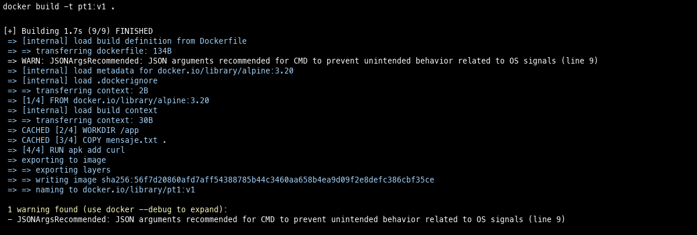

## PUNTO 2
PRIMERO CREAMOS NUESTRO VOLUMEN

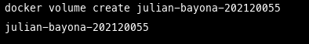

POSTERIORMENTE HACEMOS LA INSTANCIA DE NUESTRA IMAGEN PERO PASANDO EL VOLUMEN QUE ESTA EN EL HOST AL DIRECTORIO DE NUESTRO CONTENEDOR 

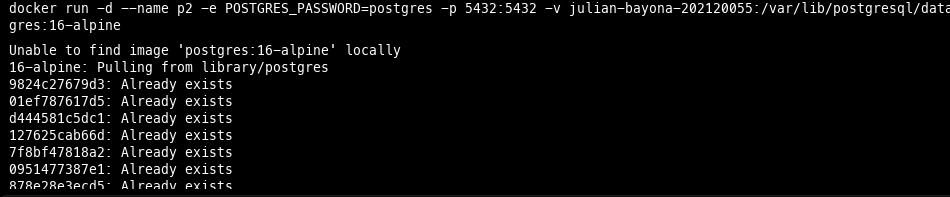

NOS INTRODUCIMOS AL CONTENEDOR Y CREAMOS E INSERTAMOS LOS DATOS CORRESPONDIENTES

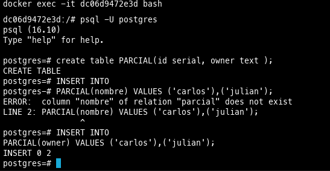

ELIMINAMOS EL CONTENEDOR

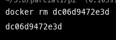

VOLVEMOS A CREAR NUESTRO CONTENEDOR 

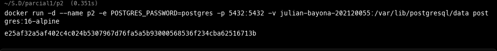

Y VERIFICAMOS LA INTEGRIDAD DE LOS DATOS ANTERIORMENTE CREADOS 

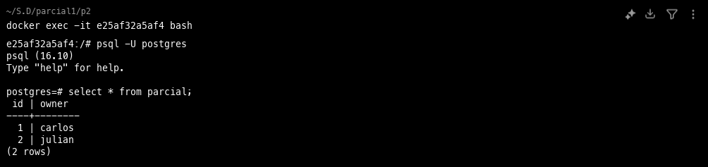

## PUNTO 3

CREAMOS NUESTRO DIRECTORIO Y CREAMOS EL HTML Y CON NANO LOS COLOCAMOS LA INFORMACION INDICADA

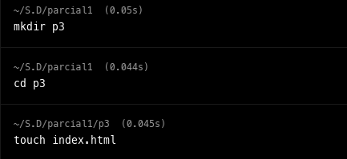

CREAMOS NUESTRO CONTENEDOR PARA QUE SEA DE SOLO LECTURA GENERANDO UN BIND DE NUESTRO INDEX PERO QUE SEA DE READ ONLY

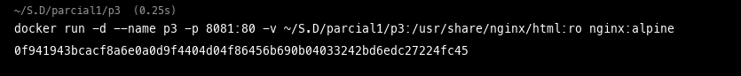

VERIFICAMOS EL CONTENIDO EN LA WEB 

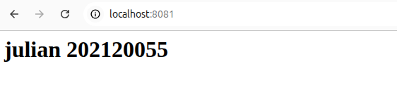

FINALMENTE EDITAMOS NUESTRO ARCHIVO CON NANO Y EVIDENCIAMOS EL CAMBIO EN NUESTRA WEB 

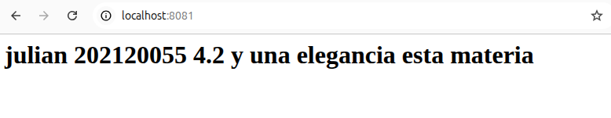

